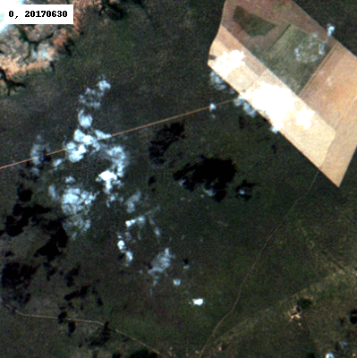

# cbersgif

Animated GIFs from CBERS data on AWS.

WIP project, check [landsatgif](https://github.com/vincentsarago/landsatgif) and [sentinelgif](https://github.com/fredliporace/sentinelgif) for related projects.

## Usage and examples

The animation typically needs to be generated in at least two passes, the first
pass is used to visualize all available images and filter out a set of undesired
images from the final animation.

The command below for instance shows all available MUX images from 2013-01-01 to 2019-03-04 covering coordinate (lon, lat) = (-56.01551, -12.8379). The images are cropped in a bounding box centered on the coordinate; width height of 20 km and 80m resolution. Each frame in the ```mux_first_pass.gif``` file has a
duration of 0.5s in the animation. Only L4 (ortho) images are selected.
For details on the other options use the --help option.

```
./cbersgif/cli.py --lat -12.8379 --lon -56.01551 --sensor MUX --start_date 2013-01-01 --end_date 2019-03-04 --max_images 50 --enhancement --buffer_size=20000 --res=80 --duration=0.5 --output=mux_first_pass.gif
```

Once this first gif is generated we may filter out undesired scenes by
specifying their index number in a ```taboo_index``` parameter. The index
is shown for each frame in the animated gif. Frames are cached by default so
this second run is much faster than the first one.

```
./cbersgif/cli.py --lat -12.8379 --lon -56.01551 --sensor MUX --start_date 2013-01-01 --end_date 2019-03-04 --max_images 50 --enhancement --buffer_size=20000 --res=80 --duration=0.5 --output=mux_second_pass.gif --taboo_index=3,4,5,6,9,11,20,22,26
```

The second pass results is:


### Deforestation detected by INPE

The following example uses coordinates from one of INPE's monitoring
programs.

```
./cbersgif/cli.py --lat -7.425944444444445 --lon -45.03827777777778 --sensor MUX --max_images 50 --buffer_size=4000 --res=20 --duration=0.5 --enhancement --start_date='2017-01-01' --taboo_index=9
```

Results in:



## Installation

Tested with python 3.6.5

```
pip install -r requirements.txt
```

### AWS

AWS access credentials must be available. Note that charges apply to data access.

Requires setting the AWS_REQUESTER_PAYER env var to be set:

```
AWS_REQUEST_PAYER=requester
```
